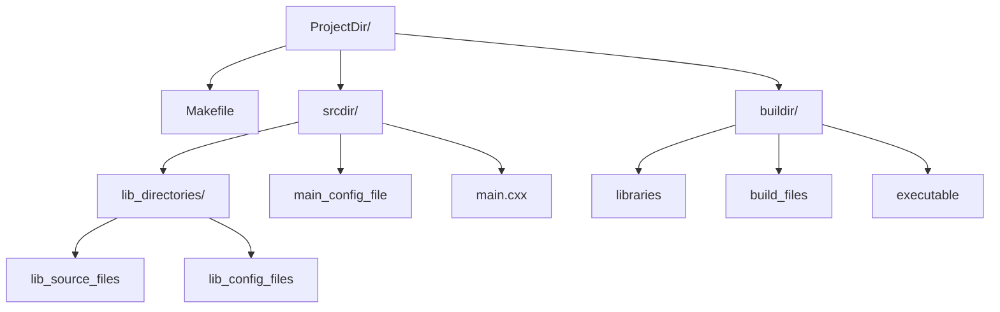

# Important Update!

This project has proved redundant when compared to [make-build_Cpp_app](https://github.com/SidhBhat/make-build_Cpp_app). It is unlikely that development
will continue. We might soon archive this repo. Ironically, this project was actually the predecessor of
[make-build_Cpp_app](https://github.com/SidhBhat/make-build_Cpp_app).

# Introduction

This is a build solution to build c++ libraries. Like others in this series, the makefile automatically detects the source files in the project
tree (using the `wildcard` function), to generate the depandancy list. The libraries can be compiled for static or dynamic linking. This is one
among a set of similar sister projects used to build c and c++ projects.

## How To Use

Using this build solution is simple. All you need to do is copy [Makefile](Makefile) into your project directory.

```bash
cd /path/to/your/project/
```

then

```bash
curl -sL https://raw.githubusercontent.com/SidhBhat/make-build_Cpp_app/main/Makefile > Makefile
curl -sL https://raw.githubusercontent.com/SidhBhat/make-build_Cpp_app/main/Makefile2 > Makefile2
# be sure to write the raw content to the correct filenames
```

Now you're going to want to set _these_ variables inside the makefile, to specify where to look for sources and where to build them.

```make
#build configuration
override srcdir     = src/
override buildir    = build/
#program Name (required only for testing!)
prog_name           = main
```

You are pretty much set now. However here are the compile time variables you can set in the makefile, or through the commandline:

```make
# Compiler options
CXX       = g++
CXXLIBS   =
CXXFLAGS  = -g -O -Wall
# Archive options
AR        = ar
ARFLAGS   = crs
# Install location
DESTDIR   =
prefix    = /usr/local/
```

There is one specail flag, that controls whether the libraries should be dynamically linked or not.

```make
# set this variable to any value to make shared libraries (cleaning existing build files may be necessary)
SHARED =
```

By calling the target `generate-config-files`, the makefile will write several `*.mk` files into the source directory.

```bash
make generate-config-files
```

These files will be included into the make process, and act as configuration files. You can specify the libraries to use and any external
libraries if required here. There will be one config file for each library. See `The Directory Structure` below for more info.

We can have one file `main.cxx` (even `main.cc` and `main.cpp` are allowed) in `srcdir/` to test our library. The executable for this is built
by calling target `test`.

```bash
make test
```

## The Directory Structure

The Directory Structure consists of a source directory and a build directory. Ideally you would keep these in your project tree, but technically
they can be anywhere. The makefile expects all source files to be directly in `srcdir/`. Every directory inside `srcdir/` that has valid c files
inside will be taken as a library, the name of the library being the same as directory name. Also the configuration files are written into the
directory of each library, and the configuration for the test executable is writted directly into `srcdir/`.

<!-- Mermaid rendering of directory structure  -->


## Sibling Projects

This Makefile is one among a set of make solutions to build c and c++ projects

  - [make-build_C_app](https://github.com/SidhBhat/make-build_C_app)
  - [make-build_Cpp_app](https://github.com/SidhBhat/make-build_Cpp_app)
  - [make-build_C_lib](https://github.com/SidhBhat/make-build_C_lib)
  - [make-build_Cpp_lib\*](https://github.com/SidhBhat/make-build_C_lib)
  - [simple-make-build](https://github.com/SidhBhat/simple-make-build)

## Contributing
If you would like to contribute, you can start by simply creating a pull request `:)`.
